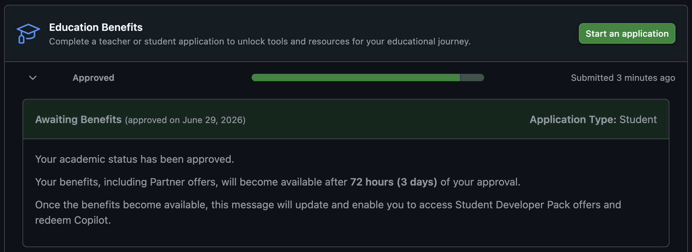

## GitHub Education

The main benefit of getting GitHub Education is that GitHub will grant you better features for GitHub Copilot - its AI coding assistant. We will be using GitHub Copilot to illustrate coding agents during the bootcamp. However, GitHub Copilot has a free tier anyway. Therefore, for the bootcamp, **GitHub Education is not necessary**. Nonetheless, I am available to help troubleshoot, so if you try the steps below before the bootcamp and they do not work, I can help on the day of.

- The GitHub Copilot plan for [students](https://docs.github.com/en/copilot/how-tos/copilot-on-github/set-up-copilot/enable-copilot/set-up-for-students){target="_blank"} sits somewhere between Copilot Free and Copilot Pro
- The GitHub Copilot plan for [teachers](https://docs.github.com/en/copilot/how-tos/copilot-on-github/set-up-copilot/enable-copilot/set-up-for-teachers-and-os-maintainers){target="_blank"} is Copilot Pro

## Application

To get GitHub Education, you need to prove your status:

1. For students: obtain proof of enrolment (see [here](https://docs.github.com/en/education/about-github-education/github-education-for-students/apply-to-github-education-as-a-student){target="_blank"} for acceptable documents and requirements). UofT graduate students can get a generated confirmation of registration letter from SGS [here](https://forms.provost.utoronto.ca/forms/sgscorl){target="_blank"}.
2. Have your proof of enrolment printed out or open on your computer
3. Sign in to your GitHub account on your mobile device (it will require you to take a photo, as simple file uploads from your computer are not allowed)
4. Go to the [education benefits webpage](https://github.com/settings/education/benefits?locale=en-US){target="_blank"} on your mobile device
5. Fill out the application. Among other things, it will require that you:
	- Have a linked education institutional email address on your GitHub profile. If you used another email to sign up, add an institutional one now [on this page](https://github.com/settings/emails){target="_blank"} and verify it.
	- Share your location via browser. If you encounter an error, it is most likely you denied your browser permission to access your location. You may need to click "Allow" on the pop-up, or go to Settings and give that browser permission.
	- Take a photo of your proof of enrolment. If you encounter an error, it is most likely you denied your browser permission to access your camera. You may need to click "Allow" on the pop-up, or go to Settings and give that browser permission.
6. Approval is automatic (some software will process the document) within a minute or two, however your benefits only become available 3 days after approval. It will look something like this:
    
7. After 3 days, return to the [education benefits webpage](https://github.com/settings/education/benefits?locale=en-US){target="_blank"} and redeem your benefits by following the hyperlinks (e.g., click **redeem Copilot via the *Copilot sign-up page***). When redeeming GitHub Copilot Student, you may enable everything except perhaps the last option regarding letting your data be used to train the model.
